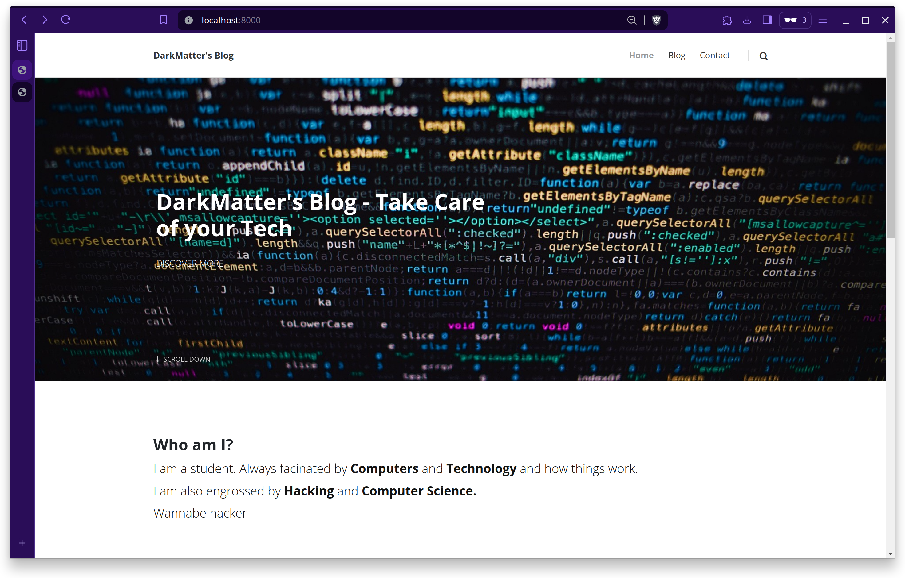

# Django Blogging Application



This is a Blogging application with full like and comment functionalities created using the Django Framework.

## Features

- Users can create, read, update, and delete blog posts.
- Users can like and comment on blog posts.
- Responsive design for mobile and desktop browsers.

## Installation
1. Clone the repository:

    ```bash
    git clone https://github.com/DarkMatter-999/Django-Blog.git
    ```

2. Navigate to the project directory:

    ```bash
    cd Django-Blog
    ```

3. Create a virtual environment (optional but recommended):

    ```bash
    python3 -m venv env
    ```

4. Activate the virtual environment:

    ```bash
    source env/bin/activate
    ```

5. Install dependencies:

    ```bash
    pip install -r requirements.txt
    ```

## Running the Application

1. Apply database migrations:

    ```bash
    python manage.py migrate
    ```

2. Create a superuser:

    ```bash
    python manage.py createsuperuser
    ```

3. Run the development server:

    ```bash
    python manage.py runserver
    ```

4. Access the application in your web browser at `http://localhost:8000`.

## Dependencies

- Django
- pillow (image storing and manipulation)
- django-tinymce (WYSIWYG editor)
- sqlite (for database)

## License

This project is licensed under the BSD 3-Clause License - see the [LICENSE](LICENSE) file for details.
